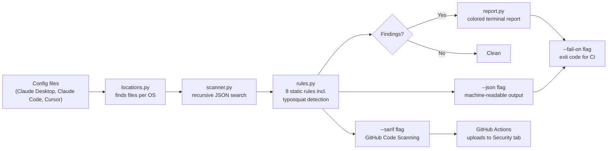

# mcp-audit

**A static security scanner for MCP (Model Context Protocol) server configs — zero AI calls, zero network requests, zero GPU.**

[](LICENSE)
[](https://www.python.org/downloads/)
[](#why-this-exists)
[](#cicd-integration)
[](https://MHaris2002.github.io/mcp-audit/)
[](#contributing)

**[Try the live web demo →](https://MHaris2002.github.io/mcp-audit/)** — no install, works on desktop or mobile, nothing you paste ever leaves your browser.

---

## Why this exists

MCP adoption has exploded across AI coding tools — Claude Desktop, Cursor, Claude Code, and others all let you plug in external "servers" that get real permissions: filesystem access, network calls, shell execution. Most developers install these with **zero visibility** into what they're actually granting.

This isn't hypothetical. In January 2026, critical vulnerabilities were discovered in Anthropic's own official Git MCP server — an officially maintained tool, not some random third-party package. If that can happen to an official server, unaudited third-party ones deserve real scrutiny.

`mcp-audit` scans the config files that control these permissions and flags patterns worth a human look — the same way a linter flags code smells rather than proving a bug exists.

Two ways to use it: the **[web app](https://MHaris2002.github.io/mcp-audit/)** for a quick, visual, no-install check anyone can run — or the **CLI** below for real machine auto-discovery, CI integration, and SARIF output.

## Table of contents

- [Live web demo](#try-the-live-web-demo)
- [What it catches](#what-it-catches)
- [Supported clients](#supported-clients)
- [How it works](#how-it-works)
- [Installation](#installation)
- [Usage](#usage)
- [CI / pre-commit usage](#ci--pre-commit-usage)
- [CI/CD integration (SARIF + GitHub Code Scanning)](#cicd-integration)
- [Example output](#example-output)
- [Project layout](#project-layout)
- [Adding a new rule](#adding-a-new-rule)
- [Roadmap](#roadmap)
- [Contributing](#contributing)
- [License](#license)

## What it catches

| Rule | Severity | What it flags |
|---|---|---|
| `hardcoded_secret` | 🔴 High | API keys, tokens, or passwords written as literal values instead of `${ENV_VAR}` references |
| `insecure_transport` | 🔴 High | Remote server URLs using unencrypted `http://` instead of `https://` |
| `dangerous_flag` | 🔴 High | Flags like `--dangerously-skip-permissions` that disable normal safety prompts |
| `possible_typosquat` | 🔴 High | A package name suspiciously close (edit distance ≤ 2) to a known official one — e.g. `server-filesytem` vs `server-filesystem` |
| `broad_filesystem_access` | 🟠 Medium | Servers granted access to broad roots (`/`, `~`, `/home`) instead of a specific project folder |
| `shell_metacharacters` | 🟠 Medium | Arguments containing `;`, `&&`, `` ` ``, or `$(...)` — worth a manual check for command injection |
| `unpinned_version` | 🔵 Low | Packages installed with `@latest` instead of a pinned version, which can change behavior without warning |
| `unverified_package` | ⚪ Info | A package not in our known-server list — not necessarily unsafe, just unverified |

Every finding includes a plain-English explanation. The tool **never makes a final verdict** — it surfaces patterns for a human to review.

## Supported clients

| Client | Global config | Project config |
|---|---|---|
| Claude Desktop | ✅ Standard install + Microsoft Store install | — |
| Claude Code | ✅ `~/.claude.json`, `~/.claude/settings.json` | ✅ `.claude/settings.json` |
| Cursor | ✅ `~/.cursor/mcp.json` | ✅ `.cursor/mcp.json` |
| Generic / custom | — | ✅ `.mcp.json` |

The scanner searches recursively for `mcpServers` blocks at any depth in a file, so it correctly finds servers even when a client (like Claude Code) nests them under a per-project structure rather than at the top level.

## How it works



Everything runs locally, synchronously, with no network calls — the entire scan of a typical config completes in well under a second.

## Installation

```bash
git clone https://github.com/YOUR-USERNAME/mcp-audit.git
cd mcp-audit
python3 -m venv venv
source venv/bin/activate        # Windows: venv\Scripts\activate
pip install -r requirements.txt
```

## Usage

| Command | What it does |
|---|---|
| `python -m mcp_audit.cli` | Scans known global config locations (Claude Desktop, Cursor) |
| `python -m mcp_audit.cli --project .` | Also scans project-scoped configs in the given directory |
| `python -m mcp_audit.cli --file path.json` | Scans one specific file directly |
| `python -m mcp_audit.cli --json` | Outputs machine-readable JSON instead of the colored report |
| `python -m mcp_audit.cli --sarif` | Outputs SARIF 2.1.0, for GitHub Code Scanning and similar tools |
| `python -m mcp_audit.cli --sarif --output results.sarif` | Writes SARIF output to a file instead of stdout |
| `python -m mcp_audit.cli --fail-on <level>` | Sets the minimum severity that triggers a non-zero exit code |

### Try it on the included examples first

```bash
python3 -m mcp_audit.cli --file tests/fixtures/clean_config.json
python3 -m mcp_audit.cli --file tests/fixtures/risky_config.json
```

## CI / pre-commit usage

`--fail-on` controls when the command exits non-zero, which is how CI systems and pre-commit hooks detect failure:

```bash
python3 -m mcp_audit.cli --fail-on high    # default — fail only on high-severity findings
python3 -m mcp_audit.cli --fail-on medium  # fail on medium severity or above
python3 -m mcp_audit.cli --fail-on any     # fail on any finding at all
python3 -m mcp_audit.cli --fail-on none    # never fail — just report
```

Combine with `--json` to pipe structured results into another tool:

```bash
python3 -m mcp_audit.cli --json > scan-results.json
```

## CI/CD integration

`mcp-audit` speaks [SARIF 2.1.0](https://sarifweb.azurewebsites.net/), the standard format GitHub's own Code Scanning uses — the same pipeline as CodeQL and Dependabot. A ready-to-use workflow is included at [`.github/workflows/mcp-audit.yml`](.github/workflows/mcp-audit.yml):

```yaml
- name: Run mcp-audit
  run: |
    python -m mcp_audit.cli \
      --file tests/fixtures/risky_config.json \
      --sarif \
      --output results.sarif \
      --fail-on none

- name: Upload SARIF to GitHub Code Scanning
  uses: github/codeql-action/upload-sarif@v3
  with:
    sarif_file: results.sarif
```

Once this runs, every finding shows up as a native alert under your repo's **Security → Code scanning** tab — correct severity badge, exact file, exact line number, no custom dashboard needed:

| Rule | Severity | Location |
|---|---|---|
| A flag disables a normal safety or permission prompt. | 🔴 Error | `tests/fixtures/risky_config.json:16` |
| A credential is written as a literal value instead of an environment variable reference. | 🔴 Error | `tests/fixtures/risky_config.json:9` |
| A server URL uses unencrypted http:// instead of https://. | 🔴 Error | `tests/fixtures/risky_config.json:3` |
| An argument contains shell metacharacters that may indicate command injection. | 🟠 Warning | `tests/fixtures/risky_config.json:21` |
| A server is granted access to a broad filesystem root instead of a specific folder. | 🟠 Warning | `tests/fixtures/risky_config.json:9` |
| A package is not present in the known-server registry. | ⚪ Note | `tests/fixtures/risky_config.json:16` |

## Example output

Scanning the included risky test fixture:

```
mcp-audit  —  scanned 1 config file(s), 4 server(s) total

risky_config.json  tests/fixtures/risky_config.json
     Server                   Rule                     Details
 🔴  sketchy-remote           hardcoded_secret         header 'Authorization' contains what looks like a hardcoded credential.
 🔴  sketchy-remote           insecure_transport       server URL uses http:// instead of https:// — traffic is unencrypted.
 🔴  over-privileged-fs       hardcoded_secret         env var 'API_KEY' looks like a hardcoded credential.
 🔴  yolo-runner              dangerous_flag           flag '--dangerously-skip-permissions' disables a safety check.
 🟠  over-privileged-fs       broad_filesystem_access  argument '/' grants access to a broad filesystem root.
 🟠  shell-injection-looking  shell_metacharacters     argument contains shell metacharacters.
 🔵  over-privileged-fs       unpinned_version         'some-fs-server@latest' is unpinned.

7 finding(s) across all scanned files. Review each one manually.
```

## Project layout

```
mcp_audit/
  locations.py   — knows where each client stores its config file, per OS
  rules.py       — the static rule engine (add new rules here)
  scanner.py     — loads config files and runs rules against them
  report.py      — renders findings as terminal report, JSON, or SARIF
  cli.py         — the command-line entrypoint
tests/fixtures/  — example clean and risky configs used to verify the tool works
.github/workflows/mcp-audit.yml — CI workflow: scans + uploads SARIF to Code Scanning
```

## Adding a new rule

Rules are plain functions in `rules.py`:

```python
def rule_my_new_check(server: str, config: dict) -> list[Finding]:
    ...
```

Add the function to `ALL_RULES` at the bottom of the file and it's automatically included in every scan. No other file needs to change.

## Roadmap

**Backend — complete:**
- [x] Static rule engine with 8 rules
- [x] Claude Desktop (incl. Microsoft Store install) + Cursor config discovery
- [x] Claude Code config support, including nested project structures
- [x] Known-server allowlist + typosquat detection (edit-distance based)
- [x] JSON output mode for CI pipelines
- [x] Configurable exit codes via `--fail-on`
- [x] SARIF output + GitHub Actions workflow for native Code Scanning integration

**Next up:**
- [ ] Finding suppression / baseline file (`.mcpauditignore`)
- [ ] Scan history + drift detection between runs
- [ ] Community-maintained, larger list of known-risky/known-good MCP servers
- [ ] `--fix` mode for safe, mechanical fixes (e.g. pinning versions)

**Web UI — complete:**
- [x] Static, client-side React web app (`mcp-audit-web/`) — same 8 rules as the CLI, verified against the same test fixtures
- [x] Deployed to GitHub Pages via Actions, auto-redeploys on changes to `mcp-audit-web/`
- [ ] Keep the JS rule engine manually in sync as Python rules evolve (see `mcp-audit-web/README.md`)

## Contributing

Issues and PRs welcome — especially new rules, additional client support, or a larger known-server list. Rules are isolated, pure functions, so contributing a new one doesn't require touching the scanner or CLI.

## License

[MIT](LICENSE)
